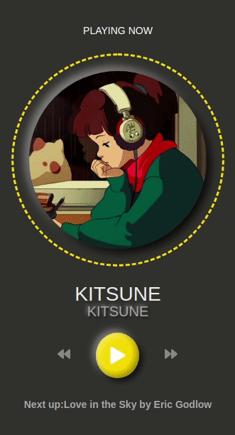

<h1 align="center">
    
</h1>

## 📌 Sobre
O projeto Music Player utiliza aplicações front-end e mobile. Um Player desenvolvido com React, perfeito para você escutar suas musicas preferidas.

---

## 💻 Tecnologias utilizadas
O projeto foi desenvolvido utilizando as seguintes tecnologias:


---

## 🗂 Como executar o projeto

```bash
# clonar repositório
git clone https://github.com/Luannaaquino/Music-Player.git

# entrar no diretório
cd Music-Player

# instalar dependências
yarn install

# executar o projeto
yarn start
```